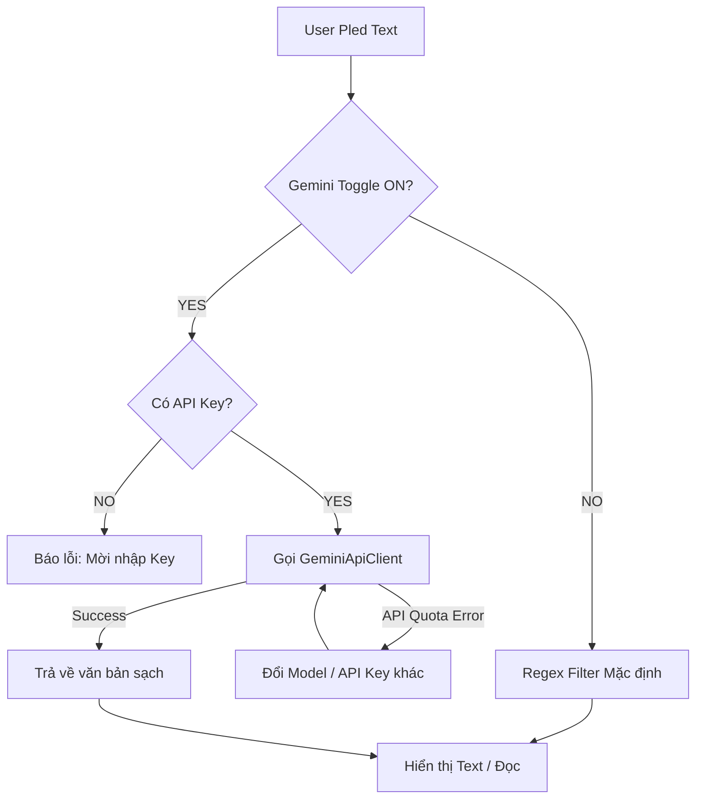

# Gemini Integration Specification

## 1. Executive Summary
Thêm tính năng "Làm sạch bằng Gemini" cho Read-Out-Loud. Ứng dụng sẽ xóa các ký tự thừa (markdown, links, bảng) thông qua model Gemini trước khi phát Text-To-Speech.

## 2. User Stories
- As a User, tôi dán nội dung đầy markdown table vào app, tôi muốn app lọc toàn bộ table để khi nghe TTS không bị rối.
- As a User, tôi có thể chuyển Toggle ON/OFF để tự quyết định có dùng AI hay không.
- As a User, tôi có thể nhập nhiều API Keys, phần mềm tự quản lý và xoay vòng để không dính lỗi Quota.

## 3. Database Design
- **Local Storage:** `EncryptedSharedPreferences`.
- **Key Name:** `api_keys_secure`.
- Mảng API keys được encode dưới mạng JSON String.
- Trạng thái Toggle được lưu ở `SharedPreferences` thông thường (`ReadOutLoudPrefs`).

## 4. Logic Flowchart

## 5. API Contract
Sử dụng Gemini REST API qua Endpoint:
`POST https://generativelanguage.googleapis.com/v1beta/models/<model_name>:generateContent?key=<api_key>`

**Models ưu tiên:**
1. `models/gemini-3-flash-preview`
2. `models/gemini-2.5-flash`
3. `models/gemini-2.5-flash-lite`
4. `models/gemini-flash-latest`
5. `models/gemini-flash-lite-latest`

## 6. UI Components
- **Main Activity:**
  - `MaterialSwitch` (ID: `geminiToggle`)
  - `ImageButton` (ID: `btnSettings`, icon bánh răng).
- **Settings Activity:**
  - `EditText` (Multiline, ID: `etApiKeys`)
  - `Button` (ID: `btnPasteApiKeys`)

## 7. Tech Stack
- Khung: Android, Kotlin, ViewBinding
- Networking: OkHttp3
- Coroutines
- AndroidX Security Crypto
- Kotlinx Serialization
