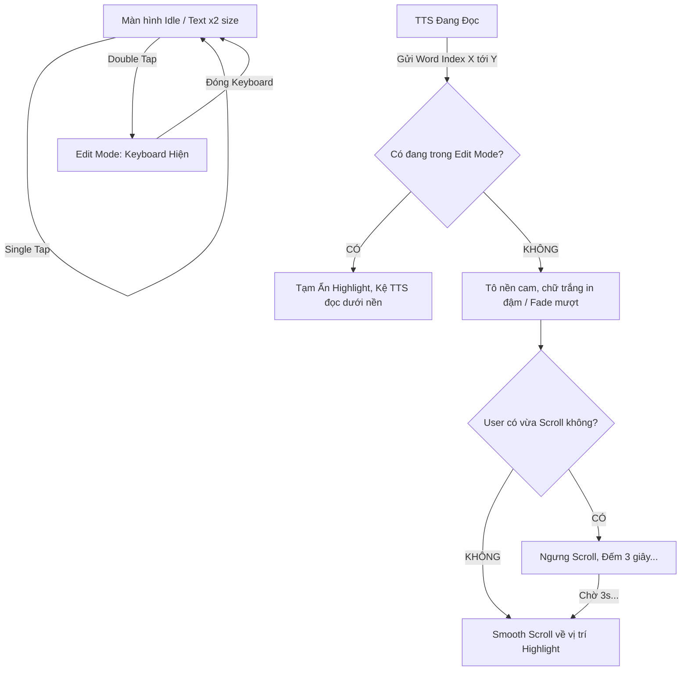

# TTS Karaoke & Read-Only UI Spec
## 1. Executive Summary
Tính năng thay đổi hoàn toàn cách tương tác với app đọc văn bản. Ngăn chạm nhầm, tăng độ to chữ (x2), bổ sung highlight karaoke mượt mà và thông minh hóa thao tác cuộn văn bản.

## 2. User Stories
- Như một người nghe sách, tôi muốn thấy chữ nào đang đọc nổi màu cam lên để dễ dò theo bài.
- Giữa lúc nghe TTS nói, tôi muốn tự vuốt lên trang trước đọc lướt mà app không tự tiện lôi tôi cuộn xuống lại, cho đến khi tôi buông màn hình ra trong 3 giây.
- Là người hay lỡ tay chạm đụng, tôi muốn gõ nhầm 1 cái lên text cũng không bị bật cụt lủn bàn phím lên che màn hình, chỉ khi tôi Double-tap (nhấn đúp) mới thực sự sửa văn bản.
- Khi tôi muốn sửa lỗi chính tả lúc app đang đọc, tôi nhấp đúp, bàn phím hiện lên, TTS vẫn nói xong câu cũ trong bộ nhớ nhưng chữ highlight biến mất để tôi sửa bề mặt chữ mới. Sửa xong đóng lại thì app tắt TTS, tôi bấm Play để đọc văn bản tôi vừa sửa.

## 3. Logic Flowchart (Double-Tap & Text Tracking)

## 4. Tech Stack & Integration Target
- Sử dụng Compose TextField với `VisualTransformation` hoặc thay thế TextField bằng tổ hợp `Text` (Read-only) & `BasicTextField` chồng lên nhau (cho Edit mode) để bắt gesture `detectTapGestures(onDoubleTap)` tối ưu nhất.
- `TtsService`: Custom Event Channel / Broadcast gửi `(start, end)`.
- UI State: Xử lý `LaunchedEffect` và `snapshotFlow` kết hợp timer coroutine debounce (3s) do interaction của User.
